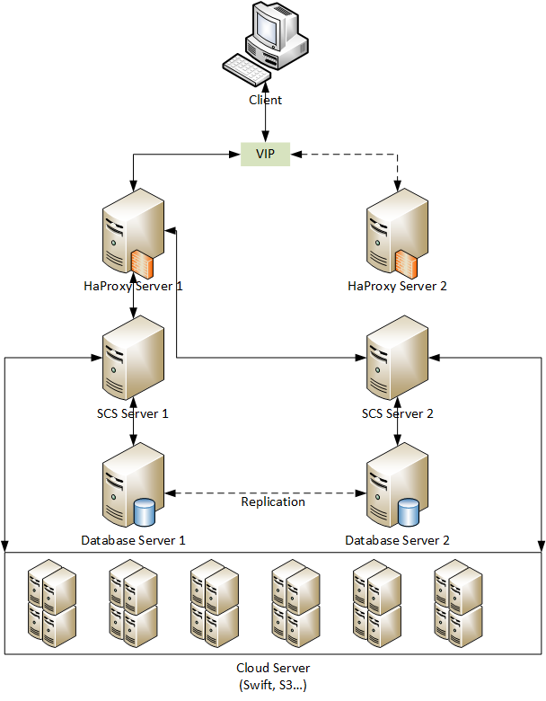

# Thiết kế hệ thống Multi Cloud Storage

## 1. Giới thiệu

Cùng với sự phát triển của công nghệ điện toán đám mây và các công nghệ lưu trữ, một phương thức lưu trữ mới ra đời, đó là phương thức **Object Storage Cloud**. Phương thức này cho phép người dùng lưu trữ các nội dung không cấu trúc - các Object data lên các Cloud server với các ưu điểm so với phương thức lưu trữ dữ liệu truyền thống: Khả năng sao lưu bản sao - replication, tốc độ truy cập dữ liệu, tính chịu lỗi, khả năng scale up - scale down hệ thống lưu trữ... Những ưu điểm trên giúp cho các nền tảng lưu trữ object storage phát triển mạnh mẽ thời gian gần đây như: Amazon S3, Swift,...

Sự phát triển của các hệ thống Cloud Object Storage đem đến cho người dùng nhiều lựa chọn hơn, tuy nhiên các như cầu sử dụng đa dạng của người dùng đặt ra một loạt vấn đề mới cho Object Storage Cloud:

- Các Object Storage Cloud không có tính đồng nhất(các API cung cấp cho người dùng khác nhau, định dạng dữ liệu khác nhau, vv...).
- Nhu cầu lưu trữ dữ liệu trên nhiều nền tảng khác nhau của người dùng có nhiều nhà cung cấp dịch vụ Object Storage.
- Nhu cầu tương tác, đồng bộ dữ liệu giữa 2 dịch vụ Cloud Object Storage.

Xuất phát từ nhu cầu thực tiễn của người dùng, nhóm phát triển quyết định xây dựng một hệ thống cho phép giải quyết các vấn đề đã nêu trên. Hệ thống được xây dựng có tên là: Multi Cloud Storage (MCS). MCS giúp người dùng:

- Giải quyết vấn đề tương tác cùng một lúc với nhiều dịch vụ Cloud Object Storage.
- Cho phép người dùng mở rộng khả năng lưu trữ một cách dễ dàng.
- Dữ liệu luôn khả dụng khi cần được sử dụng và được truy vấn một cách nhanh chóng.
- Giao diện người dùng thân thiện, dễ dàng thao tác.

## 2. Ngữ cảnh.

Trong phần này, chúng ta sẽ trình bày một kịch bản thực tế được sử dụng để làm cơ sở xuất phát cho việc xây dựng hệ thống MCS:

Một tập đoàn lớn có nhiều công ty con, mỗi một công ty con sở hữu hàng loạt các cơ sở lưu trữ dữ liệu sử dụng nhiều công nghệ lưu trữ khác nhau như như swift, amazon S3, Ceph, Google Cloud Storage, vv... Dữ liệu và các cơ sở lưu trữ của các công ty con là riêng biệt và độc lập với nhau.

Tập đoàn sẽ triển khai hệ thống MCS để thực hiện nhiệm vụ chính của MCS, đó là tích hợp tất cả các cơ sở lưu trữ dữ liệu mà một công ty con đang có thành một cơ sở lưu trữ dữ liệu thống nhất cho công ty con đó. Các yêu cầu khác của tập đoàn đối với hệ thống MCS là:

- Hệ thống được xây dựng phải phục vụ cho cả tập đoàn, tuy nhiên phải đảm các công ty độc lập với nhau.
- Dữ liệu do các công ty đưa lên được phân phối đều trên các cloud của công ty đó.
- Đảm bảo hiệu suất hoạt động của hệ thống là tối ưu.
- Đảm bảo hệ thống được thiết kế theo mô hình high-availability, đáp ứng được một lượng tải lớn.
- Đảm bảo sự an toàn của dữ liệu, kể cả trong trường hợp một số các cơ sở lưu trữ bị hỏng hóc - ngừng hoạt động.

## 3. Kiến trúc hệ thống

### Xây dựng mô hình kiến trúc hệ thống (Dự kiến)

Nhằm đảm bảo tính khả dụng cho hệ thống, hệ thống sẽ được thiết kế theo mô hình kiến trúc High-Avaibility. Hiện tại phần Cloud Server chỉ hỗ trợ Object Storage Cloud Provider (với 2 đại diện là Openstack Swift và Amazon S3)



## 4. [Phân tích các use case.](./phan_tich_yeu_cau.md)

## 5. Phân thích thiết kế các đối tượng trong hệ thống.

### 5.1. User.

Một đối tượng User cần có những thông tin sau:

- Thông tin xác thực:
    - Email/Username/Password.
    - Social Authentication Information.
- Danh sách và thông tin các đối tượng cloud server hiện có. Những thông tin này sẽ được load từ file config hoặc cho phép người dùng tự nhập theo form cho trước.
- Role (admin/member): Nếu là admin có thêm Quản lý các User khác.

### 5.2. CloudRing.

Một đối tượng CloudRing sẽ là một Chord Ring trong đó mỗi Node sẽ là một CloudServer.

- ID.
- Size.
- Danh sách CloudServer trong Ring. (Đại diện bởi CloudServer.id)

### 5.3. CloudServer.

Một đối tượng CloudServer là đại diện trừu tượng cho một Physical Cloud Server bên đưới.
- ID.
- CloudConfig. (Những thông tin về địa chỉ IP, xác thực hệ thống...)
- UserID: xác định cloud server thuộc quyền sở hữu của User nào.
- Successor Node.
- Previous Node.
- Finger Table.

### 5.4. DataObject.

Một đối tượng DataObject là đại diện cho một file/object trên hệ thống. Những thông tin cần có:

- Id: Sẽ lấy Name -> SHA-1 -> id.
- Name: tên, đường dẫn object.
- synced (default = False): True khi tất cả các replica đều có updated = True.

```python
  dataobject.synced = all(replica.updated = True for replica in dataobject.replicas)
```

- Danh sách các bản sao và trạng thái hiện tại của các bản sao. (Số lượng bản sao sẽ do người dùng quyết định nhưng nằm trong một khoảng xác định) Ví dụ:

```python
    replicas = {
        replica_01, # Đối tượng Replica (mục 5.5)
        replica_02,
        ...
    }
```
- Lịch sử giao dịch, thay đổi.

## 5.5. Replica.

Một đối tượng replica là đại diện replica của DataObject, chính ra là một object(key trong trường hợp Amazon S3)
ở dưới tầng Physical các CloudServer bên dưới.

- Id.
- updated (default = False)
